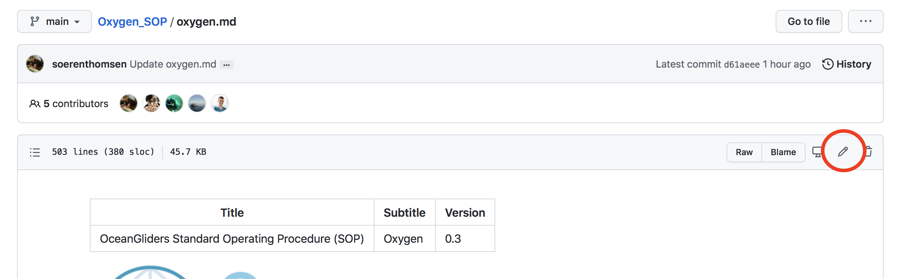

# OceanGliders Oxygen SOP Readme

This GitHub repository is for the [OceanGliders](https://www.oceangliders.org) Oxygen Standard Operating Procedure (SOP).

To read the SOP online simply follow the link [here](oxygen.md).

A PDF version can be found under [releases](https://github.com/OceanGlidersCommunity/Oxygen_SOP/releases) once we've made one.

## How to contribute

1. Log into your Github account
2. Follow the link to the SOP markdown file, [here](oxygen.md).
3. Click on the pencil on the upper right to edit the file.

5. Edit the document using magical [markdown](https://guides.github.com/features/mastering-markdown/).
6. Make a pull request, tell us briefly why you made changes, and submit.
7. The SOP team will approve your changes and you're done.
8. All contributers will be listed as co-authors on the next peer-reviewed publication.

## Next steps
1) 4 months community review on GitHub until end of January 2022
3) Submission to [Frontiers: Research Topic Best Practices in Ocean Observing](https://www.frontiersin.org/research-topics/7173/best-practices-in-ocean-observing) for peer-review
4) Depositing of major SOP releases at the [Ocean Best Practice System (OBPS)](https://www.oceanbestpractices.org)

The main SOP document will always reside in this GitHub repository to allow updates within the OceanGliders community at any time.

## Questions?
Do you have any questions related to oxygen measurements on gliders?
Or do you struggle to comment / edit the SOP document? 
Just raise a question [here](https://github.com/OceanGlidersCommunity/Oxygen_SOP/discussions).

## Licence
This work is licensed under a [Creative Commons Attribution 2.0 Generic License](https://creativecommons.org/licenses/by/2.0).

## About Markdown and Pandoc

Hosting this document on Github allows easy editing by contributors, no need to pull the repository to your local machine.
However, [Github flavoured markdown](https://github.github.com/gfm/) is missing some features which are nice to have in the final version of the document, most notably citations.
To add these features we use [Pandoc](https://pandoc.org/) and use Github actions to author a HTML and PDF version of the SOP.
