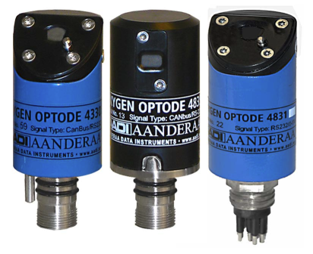
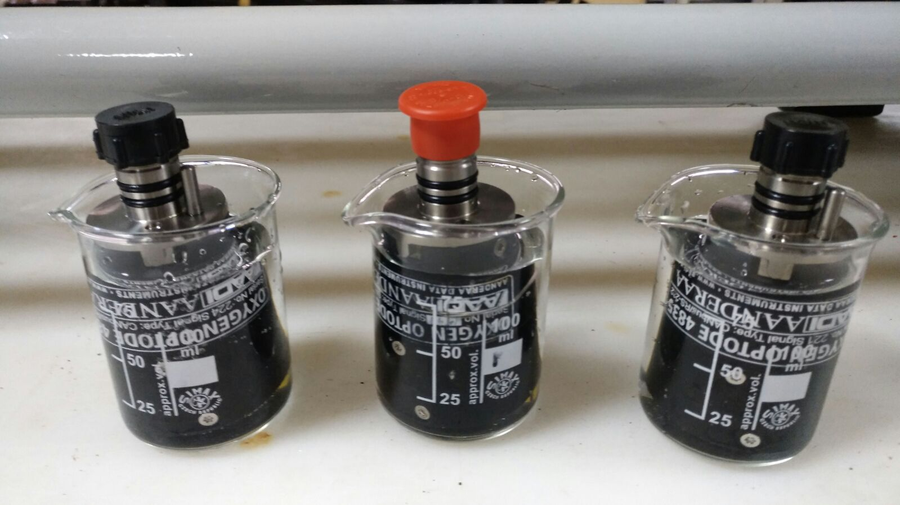
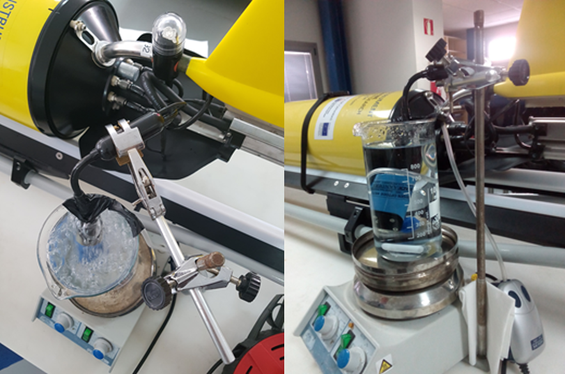
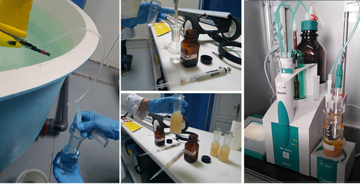

**Authors**
*(1) [Patricia López-García](https://github.com/patricialg), Ocean Technology and Engineering Group, National Oceanography Centre, Southampton, UK*
*(2) [Tom Hull](https://github.com/tomhull), Centre for Environment Fisheries and Aquaculture Science, Lowestoft, UK*
*(3) [Soeren Thomsen](https://github.com/soerenthomsen), LOCEAN, ISPL, Sorbonne University, Paris, France*
*(4) [Johannes Hahn](https://github.com/hahn-johannes), Federal Maritime and Hydrographic Agency (BSH), Hamburg, Germany*
*(5) [Bastien Y. Queste](https://github.com/bastienqueste), Department of Marine Science, University of Gothenburg, Gothenburg, Sweden*
*(6) Gerd Krahmann, GEOMAR Helmholtz Centre for Ocean Research Kiel, Germany* 
*(7) Charlotte Williams, Marine Physics and Ocean Climate Group. National Oceanography Centre, Liverpool, UK*
*(8) Mun Woo, IMOS Ocean Gliders, UWA Oceans Institute and Oceans Graduate School, The University of Western Australia, Perth, Australia*
*(9) Charitha Pattiaratchi, IMOS Ocean Gliders, UWA Oceans Institute and Oceans Graduate School, The University of Western Australia, Perth, Australia*
*(10) Laurent Coppola, Sorbonne Université, CNRS, Laboratoire d’Océanographie de Villefranche (LOV), 06230 Villefranche-sur-Mer, France*
*(11) Tania Morales, Plataforma Oceánica de Canarias (PLOCAN), Canary Islands, Spain*
*(12) [Virginie Racape](https://github.com/vracape), Institut Universitaire Européen de la mer CNRS-UMS 3113, IFREMER-coriolis, Plouzané France*
*(13) [Claire Gourcuff](https://github.com/cgourcuf), Euro-Argo ERIC, Brest, France*
*(14) John Allen, SOCIB, Palma de Mallorca, Spain*
*(15) Eva Alou-Font, SOCIB, Palma de Mallorca, Spain*
*(16) Nikolaos D. Zarokanellos, SOCIB, Palma de Mallorca, Spain*
*(17) [Victor Turpin](https://github.com/vturpin), OceanOps, Brest, France*
*(18) [Catherine Schmechtig](https://github.com/catsch), CNRS, Sorbonne Université, Osu Ecce Terra, Paris, France*

# SOP development process

1) Initial SOP was drafted by [Patricia López-García](https://github.com/patricialg), [Tom Hull](https://github.com/tomhull), [Soeren Thomsen](https://github.com/soerenthomsen) and [Johannes Hahn](https://github.com/hahn-johannes).

2) Two expert sessions during OceanGliders Best Practice Workshop, May 11 - 25 2021. 
Additional authors joined: [Bastien Y. Queste](https://github.com/bastienqueste), Gerd Krahmann, Charlotte Williams, Mun Woo, Charitha Pattiaratchi, Laurent Coppola, Tania Morales, [Virginie Racape](https://github.com/vracape), [Claire Gourcuff](https://github.com/cgourcuf), John Allen, Eva Alou, Nikolas D. Zarokanellos

3) First community and  user feedback was provided during the OceanGliders Best Practice Workshop, May 11 - 25 2021 by attendees. 

4) SOP moved to this repository by: [Patricia López-García](https://github.com/patricialg), [Tom Hull](https://github.com/tomhull), [Soeren Thomsen](https://github.com/soerenthomsen) in September 2021. 
Additional authors joined: [Victor Turpin](https://github.com/vturpin), [Catherine Schmechtig](https://github.com/catsch)

5) Next step: 4 months of community review on GitHub starting in October 2021.

# Introduction
This standard operating procedure (SOP) document for dissolved oxygen (DO) aims to guide the user through the steps necessary for collection of good quality dissolved oxygen using gliders for both real time and post deployment data streams.

*Table 1: List of the known sensor/glider combinations. We aim to cover all combinations in this document.*

| Sensor / Glider  |  Slocum |  Autosub/ ALR (NOC) |  Seaglider | Deepglider  |  SeaExplorer |  Spray |  Information |
|---|---|---|---|---|---|---|---|
| Aanderaa 3835, 4330, 4330F, 4831, 4831F and 5013 optodes  | X |   | X | X |   |   | [Link](https://www.aanderaa.com/productsdetail.php?Oxygen-Optodes-2) |
| RINKO-II  | X |   |   |   |   |  | [Link](https://www.jfe-advantech.co.jp/eng/ocean/rinko/rinko22d.html) |
| RINKO- AROD FT  |   |   |   |   | X |   | [Link](https://www.jfe-advantech.co.jp/eng/ocean/rinko/rinko-ft.html) |
| SBE 43 and 43F  |   | X | X |   | X |   | [Link](https://www.seabird.com/sbe-43-dissolved-oxygen-sensor-with-titanium-housing-mcbh-connector-0-5-mil-profiling-membrane-standard-43-plenum/product?id=54627923854) |
| SBE 63  |   |   |   |   |   | X | [Link](https://www.seabird.com/oxygen-sensors/sbe-63-optical-dissolved-oxygen-sensor/family?productCategoryId=54627869933) |
|  RBRcoda T.ODO |   |   |   |   | X |   | [Link](https://rbr-global.com/products/sensors/rbrcoda-odo) |
|  Contros Hydroflash (1) |   |   | X |   |   |   | [Link](https://www.kongsberg.com/globalassets/maritime/km-products/product-documents/hydroflash-accurate-fast-and-versatile-oxygen-optode/Download) |

(1)The advanced, optical sensor is based on the principle of fluorescence quenching. Contros are no longer in operation, the sensors cannot be calibrated so they are likely to become obsolete.

## Aanderaa Optodes
Aanderaa optodes are the most widely used oxygen sensor on gliders and a large body of work has now been dedicated to their characterisation (e.g. [@Bittig2018]).
These sensors are based on the oxygen luminescence quenching of a platinum porphyrin complex (fluorescent indicator) that is immobilized in a sensing foil. 
These offer low power consumption, good long-term stability, low fouling sensitivity while not being sensitive to H2S or freezing.
Aanderaa optodes have seen several important developments since they were introduced in 2002, with various hardware and firmware revisions which we outline below.

### Hardware design: blue or black
While mostly cosmetic, the colour of the optode is a useful short-hand for the two main optode designs.
The 3835 and 4835 optodes both feature a black housing with the temperature sensor integrated into the base of the sensor near the connector. 
This results in a large thermal mass and increases the response time of the temperature sensor significantly. 
The blue 4330 and 4831 sensors move the thermistor next to the sensing foil which results in much improved performance of the temperature sensor.
All optodes other than the 4831 use a 10 pin Lemo connector, these connectors can’t be connected when wet and are prone to crevice corrosion. 
The 4831 is therefore recommended with it’s Subconn wet-pluggable connector.
Older optode versions (3830) have a titanium housing in the same form factor as the 3835. 
Some early Slocum gliders were  delivered with optodes of type 5013, these are identical to the 3830.

### Foil type: F or standard
Most optodes use the PreSens PSt3 foil (PreSens - Precision Sensing GmbH), these have as standard a black opaque protective layer protecting the pink sensing layer.
For glider applications the “F” type foils are typically preferred as these remove the opaque layer which results in much faster diffusion across the foil, and therefore faster sensor response (8 s compared to ~ 25 s [@Bittig2014]). 
However, removal of the protective layer makes the foil more susceptible to UV radiation, and is known to reduce the sensor stability, especially when exposed to strong sunlight.
Newer 4330F and 4831F optodes (Since July 8th 2018) use an improved formulation of the Presens fast foil which are less sunlight sensitive and have much lower noise levels. These can be identified by their white appearance. 
It is recommended that older F-type instruments (with the pink foils) are upgraded with these improved foils. 
Otherwise foils should typically not be replaced unless mechanically damaged (light intrusion) as older foils perform better, with less drift than new ones.

### Calibration equation and firmware versions
The way optode foils are initially calibrated by Aanderaa, and how the measured values are processed by the optode varies between different optode versions.
The optode illuminates the sensing foil with both a red and blue LED. 
Since the red light does not produce fluorescence in the foil the phase measurements are obtained from the difference between the blue (P1) and the red (P2) excitation.

P_T = A(T) + (P1 - P2) · B(T)

Where P_T is the temperature compensated phase (known as ‘TCphase‘). 
A and B are temperature dependent coefficients which allow for temperature compensation of the phase measurement. 
However for most 4330, 4831 and 4835 optodes these are not used, such that A(T) = 0 and B(T) = 1. 
This can be confirmed by communicating with an optode and inspecting the ‘PTC0Coef‘ and ‘PTC1Coef‘ properties. 
For older optodes (4330 serial numbers < 1000) the temperature compensated phase is then used to calculate ‘calphase‘ (P_c). 
For newer optodes P_T = P_c. Similarly older optodes have their calibration (and recalibration) applied though the modification of the ‘PhaseCoef‘ coefficients. 
On later optodes the calibration is not applied in phase space, but on the oxygen concentration though the use of the ‘ConcCoef0‘ and ‘ConcCoef1‘ coefficents (‘PhaseCoef0‘ and ‘PhaseCoef1‘ are set to zero and 1 respectively). 
Consult your optode calibration sheet and confirm which terms are being used.
There are three different calibration equations used to convert the measured phase to oxygen equations:
The “Mk1” equation used by the older 3835 optodes uses a 5x4 matrix of coefficients. 
The “Mk2” equation is used by non-multipoint calibrated 4330(F) and 4835 optodes, and uses a 2x14 matrix (FoilCoefA and FoilCoefB) together with a 2x27 matrix for the polynomial degree, this second matrix is the same across all of these type optodes. 
Newer multipoint calibrated optodes use the Stern-Volmer (SVU) equation proposed by [@Uchida2008] which has 6 terms.
Non-multipoint foil calibrations are based on a common characterisation of a production batch. 
Multipoint calibrations consist of 40 calibration points across a range of concentrations and temperatures and offer improved accuracy and should be preferred when purchasing these sensors.
Consult your optode foil calibration document to verify which version your optode is using. 
Understanding these differences in how the calculations are performed is important when recalculating oxygen from the phase readings, such as when compensating for lag.
Regardless of the optode version, oxygen can be recalculated from calphase using the approach of [@Uchida2008].
During the initial months of storage/use a Foil maturation process occurs resulting in lower readings by several %. 
The maximum observed maturation induced drift on more than 1000 sensor has been 8 % for sensors with non-factory pre-matured WTW foils (model: 4835, 4531 and 5730 Steinsvik) and 6 % for sensors with factory pre-matured PSt3 foils (model: 4330, 4831, 5331 hadal). 
During/between field deployments there are possibilities for end users to post-adjust the sensors either by a one-point air-saturation adjustment or by taking reference samples (e.g. water samples and Winkler titration) and/or using a well-calibrated sensor in parallel. 
If done correctly such an adjustment should result in an absolute accuracy of around 1 % for multipoint calibrated sensors (model: 4330, 4831, 5331 and 5730) and 3 % for two-point calibrated (model: 4835, 4531), see below for more information about factory calibrations. 
The drift will decrease over time so that during the second year it is not likely to be more than 1-2 %. 
After this it should be less than 0.5 % per year, unless the foil is mechanically damaged (Aanderaa). 

|  |
|:--:|
| *Figure xx: Suit of smart optodes sensors. (Image was taken from the manufacturer webpage www.aanderaa.com)* |

## RBR coda T.ODO
The RBRcoda T.ODO uses the same foils and methods as the 4831 and 4831F so everything above specified for the 4831 will also apply to those instruments as well.
RBR refers to the standard optode (~30 s tau) foil as “slow” and the fast (~8 s) as the standard.
They also use further foil design (~1 s response) which they call fast. 
The RBR sensor has a smaller form factor than the Aandera optodes, but is overall more similar to a 4831 with the temperature sensor very closely located to the sensing foil. 
This sensor is still fairly recent on gliders and little is known for now.

## JFE Advantech RINKO
AROD-FT sensor (RINKO JFE) is used for the SeaExplorer gliders (Alseamar) and for some Argo floats (small size and low power consumption). 
This sensor is based on the optical (phosphorescence) principle which is now widely known as a remarkably fast response oxygen sensor (< 1s) with a high accuracy (± 2.0 mumol/L). 
This sensor used a multi-points calibration (16 points with 4 temperatures and 4 DO concentrations). 
In this procedure, the DO reference standards are produced by saturing the primary mixtures with DO concentrations of approximately 4%, 10%, 17% and 25% respectively (certified by the National Metrology Institute of Japan). 

The DO concentration is calculated from the [@Uchida2010] equation with 9 calibration coefficients. 
A second equation is used to take into account the pressure effect (linear equation with one calibration coefficient). 
Finally, the salinity-compensated DO concentration is calculated by multiplying the factor of the effect of salt on the oxygen solubility [@BensonKrause1984] and [@GarciaGordon1992].
This is similar to procedures used on other optodes.

Recent deployments of a SeaExplorer glider equipped with an AROD-FT sensor have shown long-term stability (low drift over time) but with a significant offset observed during sections in the Ligurian Sea (on average 10-15 mumol/kg). 
Deployments in the Bornholm Basin have shown good agreement across a wide range of oxygen concentrations with a nearby BOOS monitoring station; this sensor was a recent acquisition and had had little opportunity to drift in storage.

# Pre-deployment operations

## Storage and cleaning
Optode foils typically drift more while in storage than while in use, the reasons for this are thought to be due to exposure to UV radiation and dry air [@Bittig2018] and (Aanderaa). 
We recommend that all optodes should be stored away from the light (especially fluorescent lights), keep the foil humid and use the plastic caps provided with the sensor. Two-point calibration prior to deployment is always recommended.
Sensors should be cleaned before storage and stored with black caps on including some tap water, or with a piece of wet cotton taped against the foil. 
If sensors are stored dry the foil will dry out which could lead to 1-2 % lower readings. 
The sensor then needs to be placed in water to hydrate at least 24 h prior to starting field measurements again.

|  |
|:--:|
| *Figure xx: Keeping sensor in small beakers before and during calibration process. Only the membrane will need to be submerged in distilled water.* |

After recovery the sensor and to remove any biofouling, this is the protocol recommended by the manufacturer: 
1. If the sensor has been for too long exposed to the air, leave it overnight in a vinegar solution.
2. Next day, place the sensor in soapy water and use a brush gently if it is necessary to remove all material adhered to the surface.
3. Rinse very well with clean water and dry carefully. 

NOTE: Don’t change the foil unless it is physically damaged. 

## Sensor integration
Optodes should be configured to record the intermediate parameters (calphase and temperature), not just oxygen.
Accurate time-stamps, or offsets relative to CT measurements must be recorded for performing the lag correction.

### Mounting location

#### Spray

#### Seaglider
On Seagliders the oxygen sensor is normally mounted externally behind the CT sensor (see figure XXX). Given this exposed location it is important to mount the optode with the sensing foil facing away from incident light to avoid unnecessary UV exposure.

#### Slocum
On slocum gliders the oxygen optode is typically installed aft close to the fin (insert Figure from IMOS DMQC report?). However this positioning is not ideal for oxygen measurements due to the optode being within a region of laminar flow (Moatxxxx), additionally the optode response time has been observed to be dependent on the sensor orientation relative to the direction of flow [@Bittig2014]. 
An alternative mounting of the Aanderaa optode in a more prominent location fore of the glider fin has been demonstrated as being much more suitable for measuring oxygen on gliders (Fig. XX) [@NicholsonFeen2017]. This mounting location means that the sensor foil faces the flow directly and therefore the diffusive boundary layer thickness at the optode membrane is minimised, reducing the optode response time. Furthermore, this mounting location also means that in-situ in-air calibrations can be performed during deployment (similar to those done with Argo floats) which are beneficial when processing the DM oxygen data (see ‘in-air calibration’ section).

#### SeaExplorer
On SeaExplorer gliders, all existing oxygen sensor integrations are installed in the forward wet payload section (the nose cone). External mounting is also feasible using external puck mounts on the dry payload, located approximately 1/3 of the way back, but is rare and generally only used for instrument trials. The Rinko AROD-FT is generally installed on the forward starboard connector, with the sensing foil and temperature probe 15 centimeters back from the tip of the nose and lightly sheltered to avoid damage when making contact with the nose. Both the foil and temperature probe are well exposed to flow. The new RBR Coda integration is also planned to present the foil and probe slightly set back from the tip of the nose, while remaining exposed to unmodified flow. The SBE43 is found only when accompanied with a Seabird pumped CT sensor; both of these sensors are placed in the nose where the RBR Legato CT sensor can be seen in the figure below.

### Antifouling
Materials immersed in water experience a series of biological and chemical processes, resulting in the formation of complex layers with attached organisms. This biofouling can be divided into microfouling and macrofouling [@Delgado2021]. 
In optodes sensors, biofouling can be severe enough to block oxygen molecules from entering the sensing foil. Aanderaa has different solutions that have been successfully applied, some includes: 
Copper tape (e.g. 3M 1181) or Copper/Nickel (last much longer) are easy antifouling solutions. When applying the tape, be sure that it is not in contact with any other metal parts otherwise, the tape will lose its antifouling properties.
Paints / coatings - optical sensors, so these can only reduce growth nearby but not on the actual sensing foil
Ongoing trials: Aanderaa is focusing on non-toxic methods like fiber/hair cloth and “shark skin” film.
Mechanical wipers or UV radiation based approaches are generally unsuitable for gliders due to their increased power requirements and drag.
Regardless of whether efforts to prevent fouling are made, it is vital that post-recovery photographs are taken of the optode so that the impact of biofouling can be assessed during DMQC.

### Air saturation quality check
Based on in-air calibrations on Argo floats and gliders [@BittigKoertzinger2015], [@Johnson2015], [@NicholsonFeen2017] and [@Bittig2018] a simpler method has been recommended by the manufacturer to do it before and after deployments (Aanderaa Best Practices for Maintaining High Data Quality). This could be used during campaigns. NOTE: This won’t be useful if sensor foil is not wet or the temperature of the foil is different from that measured with the temperature sensor. 
You will need to leave the sensor logging outside in the free air for several hours before and after deployment. Remember to save the air pressure. 
*NOTE: At sea level at standard air pressure (101.3 kPa = 1 Atm = 14.69 psi) the sensors should show 100 % if wet and 102 % if completely dry; at air pressure 100 kPa it should show (1.3/101.3)*100 = 1.3 % lower.*
*NOTE: It is highly recommended to do this protocol at night when humidity is higher and the temperature is lower and more stable.* 

## Pre-deployment calibration
Optodes and similar instruments gendriferally drift more while in storage than they do in-situ. It is therefore essential that these instruments are recalibrated prior to each deployment. This is generally true even if in-situ reference (Winkler) samples are going to be taken as reference samples often won’t cover the full range of oxygen concentrations seen during the mission. As the instrument drift manifests as an increasing offset from zero in addition to a reducing sensitivity, a two point calibration is required to rescale the optodes measuring range.

### Two point calibration procedure, optode example
This protocol is recommended to do for at least two different temperatures, which cover the expected in-situ temperature range. There are several possibilities in order to achieve this, some examples:
1. Doing the experiments in labs with different temperatures. You need to leave all materials, reagents and sensors in the lab/workshop/room at least 8 hours (e.g. overnight) before starting the calibration.
2. Doing the experiment in the lab and changing the temperature. This is possible if the lab has an AC that we can turn on/off or change the temperature easily. You need to leave all materials, reagents and sensors in the lab at least 8 hours (e.g. overnight) before starting the calibration.
3. Doing the experiment using a thermostatic bath. You need to leave the 0 and 100% solutions in the bath at least overnight before starting the calibration. In this case, because we won’t be able to use a magnetic stirrer, we need to be sure we place the end of the bubble tube in the bottom of the bottle/beaker. 
In situ intercomparisons will be required to find the outset of the sensor in different seawater conditions. Therefore, samples should be taken in the tank during the ballasting (if this is 1-2 days before deployment, no more) and at the deployment/recovery site (ideally at different depths).
*NOTE: A multipoint DO calibration is necessary to obtain new foil coefficients and that can be done at the manufacturer laboratories or in any fully equipped calibration lab. These values shouldn’t be changed otherwise.*
The Winkler method is used to determine the concentration of dissolved oxygen in discrete water samples which is a highly accurate method for determination of dissolved oxygen (± 0.15 mumol kg-1). We recommend to follow the GO-SHIP protocol described by [@Langdon2010] and a well trained technician to do the sampling and analysis.

|  |
|:--:|
| *Figure X: During 100% and 0% calibration.* |

Issues with Winkler method at low oxygen concentrations (below 1 muM, some researchers consider that values below 20 muM shouldn't be use for the sensor calibration): 
- There are various issues with Winkler at low oxygen concentrations as Winkler always biases towards too high oxygen: the detection limit of the method is around 1 uM [@Langdon2010], the oxygen absorbed in the plastic of the Niskin bottles might be transferred to  the water sampled (reference needed).
- Within the core of the Peruvian oxygen minimum zones oxygen concentrations at nmol levels are present
other approaches for 0 % in-situ calibration [@Revsbech2009] and [@Thomsen2016].
- STOX sensor, new lox-oxygen sensing foils (0-10% saturation) from Aanderaa.

#### 100 / 0 % saturation protocol

This method is necessary to check drift over time as the foil wears out. It’s recommended to do it before the deployment and after recovery. NOTE: Sensor foil must be wet during all processes.   
Some information to read before we proceed with the calibration:
1. For a 100 % bubbled bath, connect an aquarium pump  to a tube which has been fitted with a porous stone (bubble dispenser) at the end. This will create small air bubbles that are sufficient to equilibrate the water rapidly. 
NOTE: It is important that the aquarium pump takes in air from an open atmosphere outside, not from inside the room/laboratory where O2 levels will be affected by the on-going activities and/or the ventilation. To verify that optodes are in saturated water you can take them up from the water and hold them just above the surface for a few minutes. There should then be no change in the saturation readings (Aanderaa Best Practices).
2. For 0 % saturation solution, add 20 g sodium sulphite to approx. 1 L. Sodium sulphite rapidly removes the oxygen and, as long as crystals of the compound can be seen, the oxygen level in the water will stay at 0. Sodium sulphite also has the advantage of being inexpensive and the level of toxicity is low. This solution is considered irritating and wearing appropriate PPE (gloves, goggles and lab coat) is recommended.
There is also an option of removing the oxygen from the water bubbling nitrogen all time. In this case you have to be sure all oxygen is removed from the solution, this will happen after 3-5 minutes bubbling (maximum volume of 100 mL approx., for bigger volume you will have to increase the time). You have to keep injecting N2 during all time of the zero calibration.
3. If any residue of the  sodium sulphite solution remains on the sensing surface, the 100 % measurement will be inaccurate. Therefore, 100 % DO saturation calibration should be performed first. To avoid contamination, always rinse well with distilled water.
4. Immerse the sensor in the 100 % bath overnight. If this is not possible, having the sensor submerged in distilled water will be enough to keep the foil wet for the calibration.
5. Always check saturation values: an outset of ± 5 % is adequate, so a value between 95 to 105 % is correct.
6. While calibrating, measure air pressure and water temperature to calculate the DO saturation estimated at current pressure. When we are on board of a ship and would like to use the data from the ship weather station, we need to check where the calibration is taking place: lab air pressure will be influenced by air conditioning systems, location of the lab (at sea level or in decks below), size and occupancy of the lab,among others. These considerations should be taken into account when working in onshore labs also. Therefore,  having a portable weather station is highly recommended. For measuring temperature, a sonde with the same or better precision as the glider sensors must be used. 

#### Communicating with the sensor using a terminal program and a cable
When the DO sensor is disconnected from the glider:
1. Connect the sensor to a PC by using a Sensor Cable (Cable #3855 for 4330/4835 optodes, Cable #5335 for 4831).
2. Start a terminal program  with the following set-up:
9600 Baud
8 Data bits
1 Stop bit
No Parity
Xon/Xoff Flow Control
3. If using Tera Terminal Pro, after setting up the com port according to settings above please select “Terminal” in the “Set up” menu and click “Local echo” also select “CR+LF” for both “Receive” and “Transmit” under “New line”.
To stop, type ‘Do Stop’.
4. Once the sensor is measuring, continue with the procedure (see section Calibration Procedure).
There is also a possibility of using a Data Logger while we are working with the sensors. 

#### Calibration procedure
Materials: Distilled water, aquarium pump, 1L and small volume beakers, stirrer and magnetic stirrer, BOD bottles, Winkler reagents, sodium sulfite solution, pipettes and tips, barometer, termometer.
Type Get All command for saving the initial sensor configuration to be able to restore old values in case something goes wrong.
1. With the sensor submerged in  the 100 % water, connect to it and start measuring.  Set the Interval property to 30 seconds. (This interval is recommended during the calibration to reduce the risk of self heating in the small container).
             
            Set Passkey(1000)
            
            Set Interval(30)
            
            Save
2. Wait until both the temperature and the phase measurements are stabilized.

3. Store calibration values by typing:
           
           Set Passkey(1000)
            
           Do CollectCalDataSat
The Save command is automatically performed.

4. Set the CalDataAPress property to the actual air pressure in hPa at the site:
           
           Set Passkey(1000)
           
           Set CalDataAPress (..)
          
           Save
5. Take 2 samples for Winkler measurement.

6. Dry the sensor carefully (make sure that the sensing foil is free from air bubbles) and immerse it in 0 % bath (0 % almost always reads correctly and is part of the calibration process). 
Wait until both the temperature and the phase measurements have stabilized (approx. 3 min).

7. To store calibration values for 0 %:
           
           Set Passkey(1000)
           
           Do CollectCalDataZero
The Save command is automatically performed.

8. To accept the new calibration and store the new coefficients in the sensor:
          
           Set Passkey(1000)
           
           Do Calibrate
The  Save command is automatically performed.

9. Rinse well with distilled water and dry the sensor foil carefully and check how it works at air. 
Save the data to check the sensor performance through time (a barometer is needed). 
Value of oxygen saturation should be 100 % or higher.

10. Put the sensor back into the 0 % water, the reading should drop to zero.

11. Set back the Interval property to 1 second (or the desired sampling frequency).
            
            Set Passkey(1000)
            
            Set Interval(1)
            
            Save
12. Type Get All command for saving the final sensor configuration for reference.

### In situ intercomparison in the tank during ballasting
This is an extra in situ intercomparison to carry out if  access to the tank while ballasting the glider is possible and the ballasting is close in time to the deployment (no more than 1-2 days before) (reference PLOCAN).
Materials: Silicon tube for sampling, multiparameter sonde, BOD bottles, Winkler reagents, pipettes and tips (or a bottle-top dispenser for reagent bottles), titration material (buretes or titrator).
1. The sensor should stay overnight submerged  in water to make the membrane wet. If the sensor is already mounted in the glider, use a wet sponge. *NOTE: Keep the sensor in the dark all time.*
2. Once the glider is in the ballasting tanks, place the silicon tube for sampling near the sensor.
3. Once the sensor measurements are stable (variations in the measurements are not higher than the precision/resolution of the sensor), start sampling water for Winkler analysis.  Take samples every 5-10 minutes, in total 4-6 samples will be required. *NOTE: Record the time we collect a sample for Winkler titration.*
4. A multiparameter sonde with a DO sensor whose precision is less than 0.1 % can be measured in the tank near the glider’s sensors (record at least values for Temperature, Conductivity and DO). *NOTE: Some DO sensors consume oxygen so, in this case, it’s recommended to move the sonde often to renew the water so the DO value does not decrease.*
5. Check the outset of the sensor by comparing  values measured by the Optode sensor with winkler values after measuring the bottle samples in the lab.

|  |
|:--:|
| *Figure xx: Taking samples for Winkler analysis during ballasting in the glider tank at PLOCAN facilities.* |

# Missions execution
This section covers the activities of those deploying and recovering the gliders in the field in addition to best practices for glider pilots.

## Deployment
While keeping the oxygen sensor protected from sunlight and kept moist any lens cover must be removed prior to deployment, use of highly visible material, such as a red flag, can aid in ensuring it’s removal in addition to the pre-deployment checklist.

In-air measurements prior to deployment can and should be carried out together with the in-situ air pressure and relative humidity measurements to provide an additional reference for calibration. Details of this procedure can be found in section XXX.

## In-situ reference samples
Even with good ballasting it can require several dives for a glider to fly correctly with an ideal dive profile. 
In warm and dry conditions the optode foil can still partially dry out even if good care is taken. 
Reference data should therefore only be performed after the glider is flying well, and ideally as close to the glider’s last known position as possible. 
Ideally multiple sets of samples should be taken unless the horizontal variability of the deployment region is very well characterised. 
This requires coordination between the deployment team and the glider pilot and should be part of the mission planning.

## In situ intercomparison during deployment/recovery from a small boat.
Materials: Silicon tube for sampling, Niskin bottles, multiparameter sonde, BOD bottles, Winkler reagents, pipettes and tips, cooling box.
It is very important that the sensor has been kept wet before the deployment and after recovery. 
This can be done by placing a wet sponge in the sensor membrane at least 8 hours before the deployment (ensure that it doesn’t get dry).

*NOTE: Remember to remove the sponge and any other material used to keep the sensor wet.*

Samples should be collected with the Niskin bottle(s) for Winkler analysis during the deployment (following [@Langdon2010] protocol). 
It’s recommended to take between 4-6 samples on the surface (approx. 5m) (ideally samples will be taken at different depths). 
After adding the Winkler reagents, samples should be kept in a dark and try to avoid high temperatures. 
It’s also recommended to use a calibrated  multiparameter sonde to do DO profiles at the deployment site while taking samples with the Niskin bottles. 
This will also help to record the sampling depths. 
When taking samples for the Winkler is not possible, values from the multiparameter sonde might be useful for in situ intercomparisons. 
The sonde must be calibrated before and after the deployment/recovery (some sondes require to be calibrated the same day, please follow manufacturer recommendations).

## Calibration during deployment/recovery from a ship with a CTD rosette equipped with a calibrated oxygen sensor 
If the glider is deployed/recovered from a research vessel equipped with a CTD and a calibrated O2 sensor, the glider optode can either be connected directly to the CTD profiler if able to receive the digital (RS232) output from the Optode [@Uchida2010], or attached via a data logger. 
Record down- and upcast data to allow hysteresis correction. The Optode data obtained during the bottle-firing stop for collection of water samples can be used for in situ calibration, since the difference between the downcast and upcast oxygen profiles is relatively small (1 uM approx., [@Uchida2008]). 
The error in the Optode can be reduced by allowing sufficient time for the sensor equilibration after the stop (minimum 2 min as recommended by [@Hahn2014]. 
*NOTE: For Oxygen Minimum Zone regions follow recommendations in the section below.*

To summarize, the steps we recommend to follow to calibrate oxygen sensors during regular CTD/O2 casts before deployment and after recovery, are:

1) Attach the glider's O2 sensors (optodes) to the CTD rosette at the same depths where the CTD oxygen sensor pumps in the water.
 
2) Record down- and upcast data. Timestamps of oxygen measurements are required. In case a logger is used, ensure before the calibration cast that the internal logger time is correct (i.e. in line with the CTD time).

3) Collect calibration points against measurements with the CTD rosette oxygen sensor, which itself is calibrated against Winkler titrated water samples [@Langdon2010]. 

4) Reference points for calibration are the same as the calibration stops. As for salinity, samples for Winkler titration will be collected during the upcast. When reached the selected depth, wait at least 2 min to ensure an equilibrated oxygen sensor [@Hahn2014]. Fire the bottles after this time. 

5) Do 0 % and 100 % calibration after recovering the sensor at two different temperatures (warm and cold lab). If 100 % is not possible, 0 % should be done to ensure that the central temperature range at zero oxygen is covered within the calibration [@Hahn2014]. 

The combined data collected following these (CTD and lab calibration) steps will be used to evaluate the calibration coefficients and it’s called hypercast calibration.

*NOTE: This calibration should be done before the deployment and after the recovery. It’s important that the membrane is kept wet.*

*NOTE: Save all data from the profiles and calibrations before deploying the glider. Always record Dphase [@Coppola2013].*

## Deploying gliders in Oxygen Minimum Zones (OMZ)
Note that the classical Winkler titration method is not reliable at oxygen concentrations in OMZ core [@Thomsen2016] since the method has a detection limit of around 1 uM [@Langdon2010]. 

Steps recommended in these regions: 
1) Do a 0/100 % calibration before and after deployment in the lab.

2) Measure Winkler in samples with concentration higher than 20 uM, typically in the mixed layer during the deployment and/or recovery. 
The Winkler method is also a problem when there is a strong vertical gradient, typically found in OMZ regions. 
Thus calibration points below the mixed layer are often not suitable. 
Look for regions with weak vertical gradients.

3) Park the glider for a few hours in the OMZ core at different temperatures to get an in-situ zero calibration points.

## Piloting
In this section specific piloting requirements during the mission execution are mentioned which are needed to allow quality control.
Towards the end of the mission power constraints often require the reduction in sampling frequency or even turning the oxygen sensor off. 
It is however essential that at least one good quality up and down cast to the maximum deployment depth is performed immediately prior to the pre-recovery samples being taken. 
Coordination between the recovery group and the pilots is essential.

### Gather data to help correct for sensor response time
Regular up- and down casts are needed to estimate and correct for the sensor response time. 
Combined up- and downcasts should be carried out at least every week and particularly at the beginning and at the end of the deployment. 
One to two days per week appear to be a reasonable compromise between energy saving and calibration quality. 
If bio-fouling is expected during the deployment it is better to collect up-down pairs earlier rather than later.

- add "Sampling rates"
- 
### Gather data to correct for sensor drift
#### Deep water masses or known anoxic waters
In regions with known oxygen concentrations i.e. within the core of the Peruvian Oxygen Minimum Zone (OMZ) oxygen concentrations of close to zero or few nmol are typical [@Revsbech2009], [@Kalvelage2013], [@Thomsen2016] in-situ calibration points can be recorded. 
For this glider can be parked at this depth to get a 0 calibration at the beginning and at the end of the deployment. 
This can also be done by adding different depth/temperature levels if the anoxic layer is thick enough to cover different temperatures. i.e. further offshore where the OMZ is several 100 m thick.

#### In-air calibration
In-air calibration can be carried out if optodes are attached in a way that they reach out of the water when the glider is surfacing [@NicholsonFeen2017] as done also for long float deployments [@Bittig2018] 
This can be valuable in particular if no 0 / 100 % lab calibration or CTD intercomparison is available as well as for long deployments. 
Contamination from splashing water and/or residual seawater on the sensor face have to be considered and corrected (Nisholson and Feen, 2017). 
Few gliders currently have this capability.

### Gather data for in-situ inter-comparisons
Other oxygen monitoring platforms, such as moorings can be used as an inter-comparison reference if the quality of these data is better than those of the glider.
The mission plan should aim to pass close to these platforms, ideally multiple times across the length of the mission.

### Observe data for evidence of biofouling
- to add text and figure to allow user separating real and “biofouling” diurnal cycling

# Real time data processing & Quality Control

## Send OceanGliders metadata and set up real time data flow 
- to add where do users find this information

## Real Time data processing
In order to get usable oxygen values in Real Time (RT), it is important to access the appropriate calibration coefficients associated with the oxygen sensor onboard the glider. 
Dissolved oxygen values computed inside the glider may not always be appropriate, and it is also important that the glider is configured so that intermediate parameters (phase measurements) are sent in RT, to allow dissolved oxygen computation using the best method associated with the sensor model, using both intermediate parameters and calibration coefficients (see [@Thierry2018]). 
In parallel, cross-check can be performed to ensure that the coefficient calibrations are appropriate by comparing dissolved oxygen internally computed and recomputed using the intermediate parameters. 
If appropriate, a time lag correction may be applied already in RT taking into account the sensor time response, using either the manufacturer value or any value defined from previous deployments with the specific sensor. A real time lag correction might improve the useability of the real time data significantly.

- to add "oxygen saturation + salinity compensation"
- to add examples of bad computation

## Real Time quality control (RTQC)

### Global range check
- to add

### Stuck value check
- to add

### Frozen profile check
- to add

### Outlier and spike check
Outliers and spikes are difficult to detect as optodes typically smooth out spikes due to their slow response time.

### Compare with climatologies and deep waters  
- to add

### Regional range check
- to add

### Neural-Network approaches
- to add

# Post-recovery operations and calibrations
At first users should report that their mission is over to support(at)oceanobs.org

## Biofouling assessment
Fotos should be taken for biofuiling assessment. 
- to add: examples of typical biofouling 

## Sensor storage
Foil must be kept wet and protected from light after recovery until validation in the lab.

## Lab calibration
When the glider is recovered, a 0% and 100% calibration is recommended as outlined above at two different temperatures levels.

## Field calibration
Follow protocol described in section ‘Calibration during deployment/recovery from a ship with a CTD rosette equipped with a calibrated oxygen sensor’.

# Delayed Mode Quality Control (DMQC)

## Sensor drift correction
Aanderaa describe the in-situ drift characteristics of the 4330 and 4831 series optodes as being < 0.5 % per year and they make no distinction between the standard or fast (“F"-type) foils [@TengbergHovdenes2014].
Optodes made after 2016 undergo a “burning-in period” during manufacture and therefore have substantially less drift [@TengbergHovdenes2014].
Drift is a function of UV exposure and sampling frequency. 
The foil becomes less sensitive (therefore drift is always towards lower oxygen concentrations). 
The drift is believed to be due to bleaching of the luminophore foil via ambient light; it is particularly sensitive to fluorescent lights. 
The bleaching effect is partly counteracted by a destabilising effect on the luminophore. 
Together this manifests as a positive factor on the oxygen concentration (slope > 1) and a positive offset at zero oxygen.

[@Queste2018] recorded drifts of 0.0176 and 0.0109 umol/kg/day for two Seagliders using inflections in the oxygen profiles as the glider penetrated to Arabian Sea Oxygen Minimum Zone and the sodium sulphite method, but no Winklers. 
[@BittigKoertzinger2015] report a 10 % drift over 3 years, but this is a combination of in-situ and ex-situ drift. 
[@Bittig2018] determined the drift to be typically 0.1-0.2 % per year in-situ. 
A drift of 0.0004 % d-1 has been calculated based on UEA seagliders against Baltic deep water oxygen climatology (Possenti et al., 2020).
Tom Hull found values between 0.0004 and 0.0035 % d-1 across 16 vehicles in-situ (slocums and seagliders with 4330F (old foil formulation), 4835 and 4831 optodes (unpublished?). 

The drift correction should be applied to the oxygen concentration, not the measured phase [@Bittig2018].

## Sensor time response correction
In all but the most homogeneous waters it is essential to correct for the slow time response of optodes. This is particularly critical for optodes using the “standard” black foils.
Correction requires the collection of optode phase and temperature and therefore the instruments and gliders should be configured to collect these variables and not just oxygen concentration or saturation. 
Accurate time-stamps for these data are required to be able to perform this correction.

- add rest after join discussion and convergence

## Light intrusion
Optodes can be sensitive to light intrusion if the foil is damaged. 
These instruments will typically still provide good data in the absence of light. 
A check should be made for increased sensor noise near the surface during daylight hours and contrast this with night-time observations.

# Data delivery to public open access archives
- list archives and best practices how to store data
- get input of data management 

# Acknowledgement 
The coordination of producing this document was supported by the European Commission via the EuroSea.eu project under H2020 funding (Grant agreement 862626) and GROOM || Horizon 2020 research and innovation programme (Grant agreement No 951842).

 

Patricia Lopez-Garcia was supported by TechOceanS project which received funding from the European Union’s Horizon 2020 research and innovation programme under grant agreement No 101000858 (TechOceanS). This output reflects only the author’s view and the Research Executive Agency (REA) cannot be held responsible for any use that may be made of the information contained therein.

Tom Hull was supported by “Alternative framework to assess marine ecosystem functioning in shelf seas" (https://projects.noc.ac.uk/altereco/). AlterEco represents a pilot study of a novel monitoring framework to deliver improved spatiotemporal understanding of key shelf sea ecosystem drivers through the use of autonomous systems, primarily underwater gliders. It was funded by the UK National Environment Research Council (NERC), the UK government’s Department for Environment, Food and Rural Affairs (Defra), the World Wide Fund for Nature (WWF) grant numbers NE/P013899/1, NE/P013902/2, NE/P013740/1 and NE/P013864/1.

This work also contributes to the MOOSE network, which is funded by the CNRS-INSU and the French Ministry for Education and Research (ILICO).

# References
