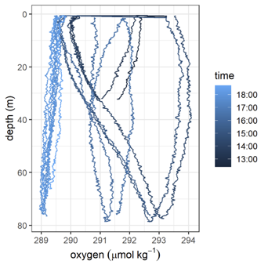
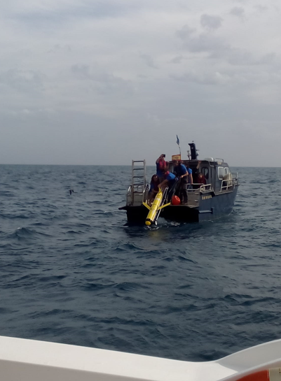
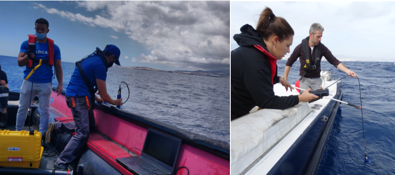
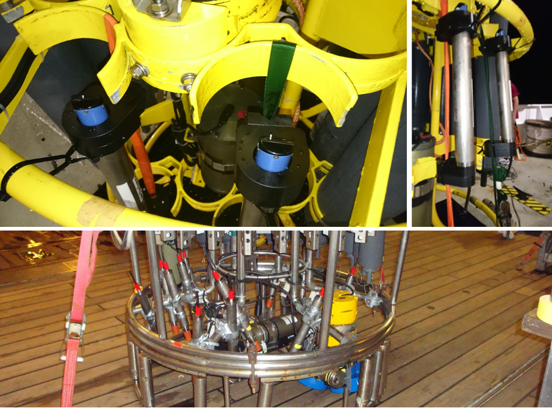
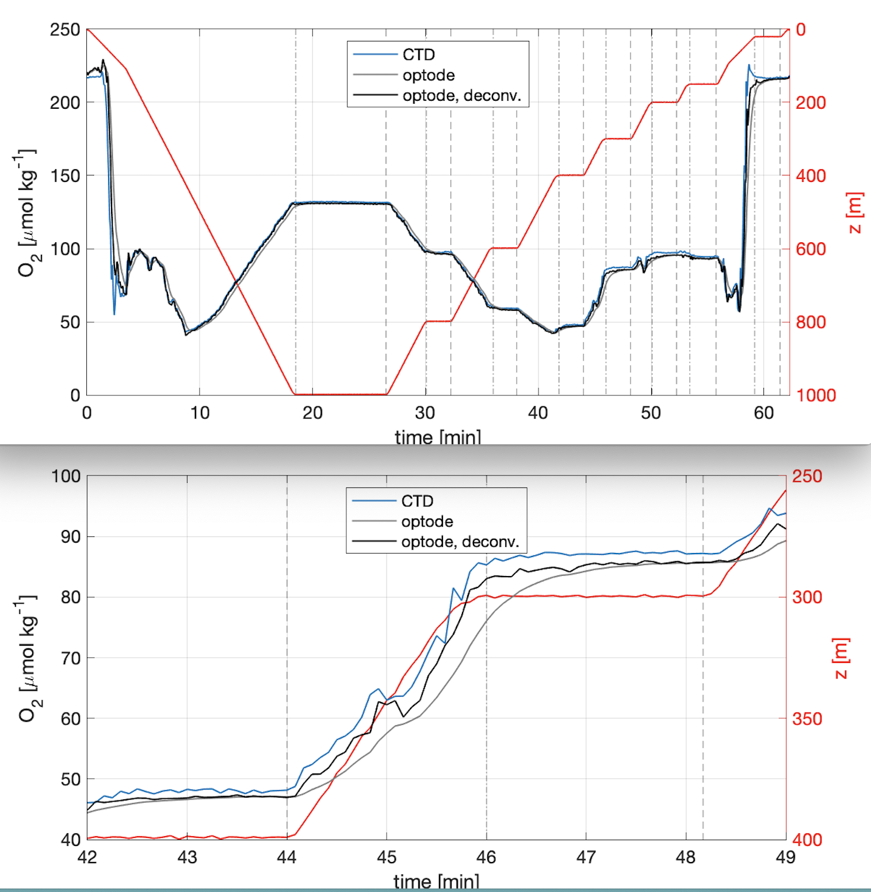

(mission-execution)=
# Missions execution

This section covers the activities of those deploying and recovering the gliders in the field in addition to best practices for glider pilots.

## Deployment
While keeping the oxygen sensor protected from sunlight and kept moist, any lens cover must be removed prior to deployment. The use of highly visible material, such as a red flag, can aid in ensuring its removal in addition to the pre-deployment checklist.

In-air measurements prior to deployment can and should be carried out together with the in-situ air pressure and relative humidity measurements to provide an additional reference for calibration. Details of this procedure can be found in the in-air calibration section.

*NOTE: Remember to remove the sponge and any other material used to keep the sensor wet.*

:::{figure-md} dryfoil

Effect of dry foil, first dives show elevated oxygen concentrations and slow foil response times. Taken from AlterEco AE2 Slocum “Stella” using a 4330 optode (standard foil).
:::

## In-situ reference samples
Even with good ballasting it can require several dives for a glider to fly correctly with an ideal dive profile. 
In warm and dry conditions the optode foil can still partially dry out even if good care is taken. 
Reference data should therefore only be performed after the glider is flying well, and ideally as close to the glider’s last known position as possible. 
Ideally multiple sets of samples should be taken unless the horizontal variability of the deployment region is very well characterized. 
This requires coordination between the deployment team and the glider pilot and should be part of the mission planning.

(deployment_small_boat)=
## In situ intercomparison during deployment/recovery from a small boat
Materials: Silicon tube for sampling, Niskin bottles, multiparameter sonde, BOD bottles, Winkler reagents, pipettes and tips, cooling box.
It is very important that the sensor has been kept wet before the deployment and after recovery. 
This can be done by placing a wet sponge in the sensor membrane at least 24 hours before the deployment (ensure that it doesn’t get dry).

Samples should be collected with the Niskin bottle(s) for Winkler analysis during the deployment (following {cite}`Langdon2010` protocol). 
It’s recommended to take between 4-6 samples on the surface (approx. 5 m) (ideally samples will be taken at different depths). 
After adding the Winkler reagents, samples should be kept in the dark and try to avoid high temperatures. 
It’s also recommended to use a calibrated multiparameter sonde to do DO profiles at the deployment site while taking samples with the Niskin bottles. 
This will also help to record the sampling depths. 
When taking samples for the Winkler is not possible, values from the multiparameter sonde might be useful for in situ intercomparison. 
The sonde must be calibrated before and after the deployment/recovery (some sondes require to be calibrated the same day, please, follow manufacturer recommendations).

:::{figure-md} CoastalDeployment

Coastal deployment of a Slocum glider from a small boat (photo taken during the Glider School at PLOCAN).
:::

:::{figure-md} multiparametersonde

Using a multiparameter sonde for in-situ intercomparison during deployments from small boats.
:::

(deployment_ship_CTD)=
## Calibration during deployment/recovery from a ship with a CTD rosette equipped with a calibrated oxygen sensor 
If the glider is deployed/recovered from a research vessel equipped with a CTD and a calibrated O2 sensor, the glider optode can either be connected directly to the CTD profiler if able to receive the digital (RS232) output from the Optode {cite}`Uchida2010`, or attached via a data logger. 
Record down- and upcast data to allow hysteresis correction. The Optode data obtained during the bottle-firing stop for collection of water samples can be used for in situ calibration, since the difference between the downcast and upcast oxygen profiles is relatively small (1 μmol kg-1 approx., {cite}`Uchida2008`). 
The error in the Optode can be reduced by allowing sufficient time for the sensor equilibration after the stop (minimum 2 min as recommended by {cite}`Hahn2014`. 
*NOTE: For Oxygen Minimum Zone regions follow recommendations in {numref}`deploying_in_omz`*

To summarize, the steps we recommend to follow to calibrate oxygen sensors during regular CTD/O2 casts before deployment and after recovery, are:

1) Attach the glider's O2 sensors (optodes) to the CTD rosette at the same depths where the CTD oxygen sensor pumps in the water.
 
2) Record down- and upcast data. Timestamps of oxygen measurements are required. In case a logger is used, ensure before the calibration cast that the internal logger time is correct (i.e. in line with the CTD time).

3) Collect calibration points against measurements with the CTD rosette oxygen sensor, which itself is calibrated against Winkler titrated water samples {cite}`Langdon2010`. 

4) Reference points for calibration are the same as the calibration stops. As for salinity, samples for Winkler titration will be collected during the upcast. When reached the selected depth, wait at least 2 min (see {numref}`CTD_calibration_stop`) to ensure an equilibrated oxygen sensor {cite}`Hahn2014`. Fire the bottles after this time. 

5) Do 0 % and 100 % calibration after recovering the sensor at two different temperatures (warm and cold lab). If 100 % is not possible, 0 % should be done to ensure that the central temperature range at zero oxygen is covered within the calibration {cite}`Hahn2014`. 

The combined data collected following these (CTD and lab calibration) steps will be used to evaluate the calibration coefficients (hypercast calibration).

*NOTE: This calibration should be done before the deployment and after the recovery. It’s important that the membrane is kept wet.*

*NOTE: Save all data from the profiles and calibrations before deploying the glider. As noted in {numref}`sensor_configuration` Always record the phase readings {cite}`Coppola2013`.*

:::{figure-md} datalogger

GEOMAR oxygen data loggers (Aanderaa Optode mounted on data logger) attached to a CTD frame and prepared for in-situ calibration during a CTD cast. Panels in the upper row show fixation with straps and zip ties. Panel in the lower row shows fixation with scaffolding clamps and tape in the interior lower part of the CTD frame. 
:::

:::{figure-md} CTD_calibration_stop

Example oxygen time series for an in situ calibration of an optode at a CTD rosette. "deconv" means, that an inverse low pass filter was applied to the optode oxygen time series in order the correct for the response time effect.
:::

(deploying_in_omz)=
## Deploying gliders in Oxygen Minimum Zones (OMZ)
Note that the classical Winkler titration method is not reliable at oxygen concentrations in OMZ core {cite}`Thomsen2016` since the method has some limitations.
There are various issues with Winkler at low oxygen concentrations that have been described in the bibliography: 
- In waters with concentrations below 5 μmol kg-1, high concentration of nitrite may cause a positive oxygen bias {cite}`Langdon2010`. In more recent articles, scientists even avoid using Winkler at concentrations below 20 μmol kg-1 {cite}`Thomsen2016`.  
- Oxygen absorbed in the plastic of the Niskin bottles is transferred into the water sampled. This oxygen contamination increases the concentration obtained when follow Winkler method. It has been measured values of apparent concentration of 2 - 4 μmol kg-1 in the Pacific minimum zones, showing a significant positive bias {cite}`Garcia-Robledo2021`.
- Presence of extremely low concentrations of oxygen concentrations (nmol levels) in areas like the core of the Peruvian oxygen minimum zones.

Thus, when working in these areas, it is recommended to do:
- In-situ approaches for 0 % calibration suggested by {cite}`Thomsen2016`.
- Additionally, Intercomparisons with STOX sensors attached to a shipboard CTD {cite}`Revsbech2009` or new use the low-oxygen sensing foils (0-10% saturation) from Aanderaa.

- Do a 0/100 % calibration in the lab before deployment and after recovery.
- Measure Winkler in samples with concentration higher than 20 μmol kg-1, typically in the mixed layer during the deployment and/or recovery. 
The Winkler method is also a problem when there is a strong vertical gradient, typically found in OMZ regions. 
Thus, calibration points below the mixed layer are often not suitable. 
Look for regions with weak vertical gradients.
- Park the glider for a few hours in the OMZ core at different temperatures to get an in-situ zero calibration points.

## Piloting
In this section, specific piloting requirements during the mission execution which are needed to allow quality control are mentioned.
Towards the end of the mission power constraints often require the reduction in sampling frequency or even turning the oxygen sensor off. 
It is however essential that at least one good quality up and down cast to the maximum deployment depth is performed immediately prior to the pre-recovery samples being taken. 
Coordination between the recovery group and the pilots is essential.

### Gather data to help correct for sensor response time
Regular up- and downcasts are needed to estimate and correct sensor response time. 
Combined up- and downcasts should be carried out at least every week and particularly at the beginning and at the end of the deployment. 
One to two days per week appear to be a reasonable compromise between energy saving and calibration quality. 
If bio-fouling is expected during the deployment it is better to collect up-down pairs earlier rather than later.

Several parameters, namely response time, profiling velocity and vertical oxygen gradient, have an impact on a feasible sampling interval and therefore on the error of the reconstructed true oxygen profile {cite}`Bittig2014`. {cite}`Bittig2014` mentions that "the sample interval should be significantly shorter than the response time $\tau$ to resolve gradient regions and to be able to reconstruct the true oxygen profile." Thus, a sufficient high frequency sampling, here interpreted as an order of magnitude faster, is required for a good lag correction. In particular in areas with a strong oxycline, we recommend to always sample at 5 s period. If battery lifetime is an issue, periodic up- and down dives with high frequency sampling are more useful than continuous measurement at a lower frequency.

### Gather data to correct for sensor drift
#### Deep water masses or known anoxic waters
In regions with known oxygen concentrations, in-situ calibration points can be recorded, i.e. within the core of the Peruvian Oxygen Minimum Zone (OMZ) where typical oxygen concentrations are close to zero or only a few nmol kg-1 {cite}`Revsbech2009`, {cite}`Kalvelage2013`, {cite}`Thomsen2016`. 
In these regions, the glider can be parked at this depth to get a 0 calibration at the beginning and at the end of the deployment. 
This protocol can also be improved by adding different depth/temperature levels if the anoxic layer is thick enough to cover different temperatures. i.e. further offshore where the OMZ is several 100 m thick.

(in-air-calibration)=
#### In-air calibration
In-air calibration can be carried out if optodes are attached in a way that they reach out of the water when the glider is surfacing {cite}`NicholsonFeen2017` as done also for long float deployments {cite}`Bittig2018` 
This can be valuable in particular if no 0 / 100 % lab calibration or CTD intercomparison is available as well as for long deployments. 
Contamination from splashing water and/or residual seawater on the sensor foil have to be considered and corrected {cite}`NicholsonFeen2017`. 
Few gliders currently have this capability.

### Gather data for in-situ inter-comparisons
Other oxygen monitoring platforms, such as moorings can be used as an inter-comparison reference if the quality of these data is as good or better than from the glider.
The mission plan should aim to pass close to these platforms, ideally multiple times across the length of the mission.
