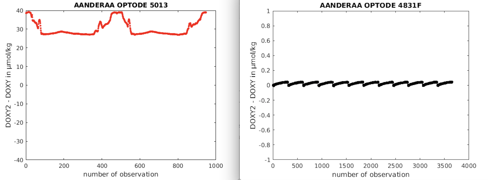

(rtqc)=
# Required Metadata, Real Time Data Processing & Quality Control

## Required Metadata and Real Time Data Processing

Configurations for the calculation of DOXY are function of the sensor model, sensor serial number, set of calibration coefficients and intermediate parameters. The recommended configurations (e.g. salinity compensation of MOLAR_DOXY, pressure correction for pressure effect on quenching, temperature compensation) and thus the required metadata are available in the Processing Argo oxygen data at the DAC level (<https://archimer.ifremer.fr/doc/00287/39795>).

Prior to deployment, all the required metadata should be sent ahead of the mission to the Data Assembly Center. It is important that the glider is well configured, intermediate parameters (phase measurements) should be sent in real time (RT) as well. This will allow first to check if dissolved oxygen values computed inside the glider are appropriate {numref}`RTQC_check_Doxy` and then this adds the possibility to recompute the dissolved oxygen concentration using the up to date method associated with the sensor model, intermediate parameters and calibration coefficients. 

<!--

-->

:::{figure-md} RTQC_check_Doxy

Difference between oxygen concentration computed by the glider (DOXY) and those computed by the Data Assembly Center (DAC) from intermediate parameters and associated calibration coefficient (DOXY2).
:::

For some optode models with large time response (e.g. 3835), it may be appropriate to apply a first time lag correction in RT, taking into account the sensor time response, using either the manufacturer value or any value defined from previous deployments with the specific sensor. A real time lag correction might improve the usability of the real time data significantly (see methods for such corrections in {numref}`dmqc_time_response`).

There is no unique procedure for Real time data and metadata sending. Protocols, format and file naming convention should be discussed with DACs before deployment. OceanOPS and DACs requirements on data and metadata are described in the OceanGliders Best Practices document in the data and metadata management section, paragraph 6 (link to be added when overview paper is in review). 

## Real Time Quality Control (RTQC)
Real time quality control tests applied on EGO oxygen data are extracted from the [Argo quality control manual for dissolved oxygen](https://archimer.ifremer.fr/doc/00354/46542/82301.pdf). Details are summarized below. These tests are applied in supplement to trajectory tests. 
RTQC applied on the temperature measured by the oxygen sensor should follow the RTQC procedure defined for the CTD temperature. 

### Doxy QC initialization
Several oxygen sensors suffer from predeployment storage drift that can reduce accuracy by up to 20% or more {cite}`Bittig2019`. As a consequence and because this bias can be corrected, dissolved oxygen concentration measured in real time should be set to 3 “bad data that are potentially correctable”. To retrieve usable oxygen data, an adjustment in real time should be quickly performed. 

### Global range check
This test applies a gross filter on EGO oxygen data. If one observation is out of the global range [-5, 600] μmol kg-1, its QC flag is set up to 4 “bad data”.

### Outlier and spike check
Outliers and spikes are difficult to detect as optodes typically smooth out spikes due to their slow response time. A simple test checking the differences between sequential measurements is nevertheless possible if i) it is applied on a specific phase (ascending or descending for example) and ii) assuming a sampling adequately reproduces changes in dissolved oxygen concentrations. In this context, if one measurement is significantly different from adjacent ones, it is a spike in both size and gradient. 

Test value = | V2 - (V3 + V1)/2 | - | (V3 - V1) / 2 |

Where V2 is the measurement being tested as a spike, V1 and V3 are the values above and below. 

V2 value should be flagged as 4 “bad data”, when:
Test value > 50 µmol kg-1 for pressure < 500 dbar
Test value > 25 µmol kg-1 for pressure >= 500 dbar

### Stuck value test
This test looks for EGO oxygen data in the same phase (ascending or descending for example) being identical. Stuck values should be flagged as 4 “bad data”.

### Bad P/T/S QC spreading

The test checks that the dissolved oxygen concentration in μmol kg-1 is computed from a valid pressure, temperature and salinity. 
Considering the pressure or temperature impact on the oxygen conversion, when pressure or temperature is marked as bad (qc = 4), oxygen concentration should be set to 4. 
Conversely, and as the salinity impact on the oxygen conversion is less than previous parameters, when salinity is marked as bad, oxygen concentration should be set to 3. 

### Effects of biofouling on optode measurements

Biofouling can impact the optode measurements in different ways and the real time data should be carefully checked to assess typical effects of biofouling. 
Two examples for the effects of biofouling on the oxygen concentrations reported by optodes are shown in {numref}`biofouling_data`. In {numref}`biofouling_examples` you can see the biofouling on the glider.

:::{figure-md} biofouling_data

Left: Rapidly decreasing reported oxygen concentrations caused by the growth of a gooseneck barnacle on the optode foil. 
At the end of the deployment the barnacle prevented all exchange of oxygen between water and foil. 
Right: Slow effects of algae growth on the foil. 
Towards the end of the deployment a diurnal cycle in the reported near-surface oxygen concentrations becomes visible. 
Elevated reported oxygen concentrations coincide with local daylight times and the glider being in the euphotic zone.
:::
